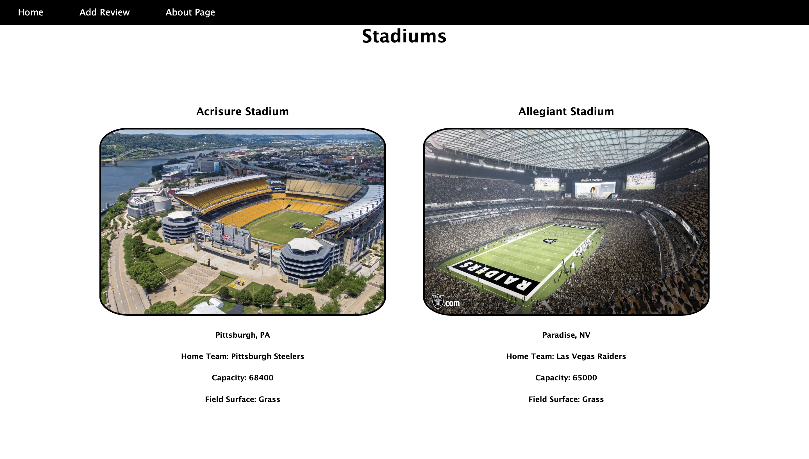

# Football-Fan-Experience

## Date 2/08/23

### By: Michael Durando

#### [LinkedIn](https://www.linkedin.com/in/michael-durando-101050138/) | [GitHub](https://github.com/mjdurando82)

---

### **_Screenshots_**



![ReviewForm] Screenshot 2023-02-16 at 12.32.49 PM.png

![About] (Screenshot 2023-02-16 at 12.33.02 PM.png)

---

### **_Description_**

#### This application was designed for NFL fans. Here you can give your experience at the NFL game a rating and review. You can also get information on a stadium that you may want to go to!

#### This application was developed to help fans showcase their experience at NFL stadiums.

---

### **_Technologies Used_**

- React
- Express
- Mongoose
- Node
- HTML
- Javascript
- CSS

---

### **_How to Get Started_**

#### Visit the page, pick the stadium that you visited or are interested in to get more information. You can leave your review or check out other reviews!

#### A Trello board was used to track and organize the development progress and can be viewed here. [Trello](https://trello.com/b/9x63GvUm/football-fan-experience)

---

#### 

####

---

### **_Future Updates_**

#### In the future I would like to add a comment thread for each review, that way you can interact with other user and talk about your experience.

#### I would also like to change the ratings from 1-5 to a star rating from 1-5 where the user can select their rating with stars instead of typing in 1-5.

#### I want to add some form of user authentication so that a review may not be edited or deleted by anyone on the page. These options should only be accesible to the user who posted the review.

---

### **_Credits_**

- https://www.visitphilly.com/wp-content/uploads/2017/12/lincoln-financial-field-eagles-fireworks-587.jpg
-
-
-
-
-
-
-
-
-
-
-
-
-
-
-
-
-
-
-
-
-

```

```
